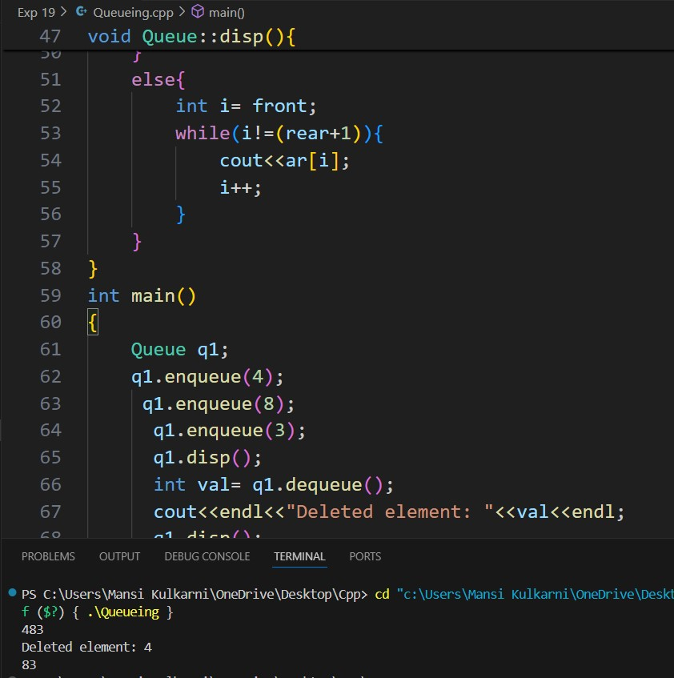

# Experiment 19
## Aim: 
To study and implement Queue implementation using an array.
## Software used: 
Visual Studio Code
## Theory:
A queue is a linear data structure that follows the First-In-First-Out (FIFO) principle. The first element added to the queue is the first one to be removed. Queues are used in various applications such as scheduling tasks, managing requests in servers, or buffering data streams.
### Key Operations in a Queue:
1. Enqueue: Adding an element to the back of the queue.
2. Dequeue: Removing an element from the front of the queue.
3. Front: Accessing the element at the front of the queue without removing it.
4. Rear: Accessing the element at the back of the queue.
5. isEmpty: Checking whether the queue is empty.
6. isFull: Checking whether the queue is full (in the case of a fixed-size queue).
## Output:

## Conclusion:
We learned about Queueing and implemented it in C++. 
